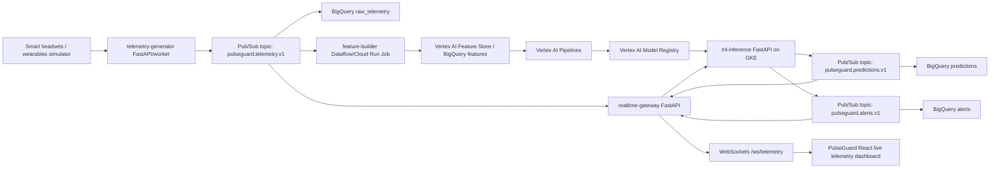

# PulseGuard AI Real-Time Platform

PulseGuard AI is evolving from deterministic mock dashboards into a real-time operational intelligence platform for hospital workforce monitoring. This platform pack adds the cloud architecture, synthetic wearable telemetry services, ML inference contracts, Kubernetes deployment assets, and MLOps roadmap needed to simulate and later productionize staff burnout prediction.

The current React/TanStack app remains the operator console. The new platform layer introduces streaming telemetry, live WebSocket updates, predictive inference, BigQuery storage, Vertex AI training, and GKE Autopilot microservices.

## Target Architecture



## Service Breakdown

| Service | Runtime | Responsibility | Scales by |
| --- | --- | --- | --- |
| `telemetry-generator` | Python worker / FastAPI admin | Emits realistic wearable and operational telemetry for synthetic staff digital twins. Publishes to Pub/Sub or stdout for local tests. | Staff count, publish interval, Pub/Sub throughput |
| `realtime-gateway` | FastAPI | Receives Pub/Sub push events, normalizes state, exposes REST snapshots and WebSocket streams to the React console. | WebSocket connections, event rate |
| `ml-inference` | FastAPI | Serves burnout risk prediction, fatigue forecasts, anomaly detection, workload forecast, and intervention recommendations. | Request rate, model latency |
| `feature-builder` | Dataflow or Cloud Run Job | Builds rolling time-window features into BigQuery/Vertex Feature Store. | BigQuery partitions, hourly/daily windows |
| `training-pipeline` | Vertex AI Pipelines | Trains XGBoost, LightGBM, LSTM/temporal models, and Isolation Forest; registers models. | Scheduled retraining, drift-triggered retraining |
| `PulseGuard React app` | Cloud Run now, GKE/Cloud CDN later | Operator UI: live telemetry, heatmaps, digital twins, predictions, alerts, AI copilot. | HTTP traffic |

## Pub/Sub Topics

| Topic | Producers | Consumers |
| --- | --- | --- |
| `pulseguard.telemetry.v1` | `telemetry-generator`, future device gateway | `realtime-gateway`, BigQuery subscription, feature builder |
| `pulseguard.predictions.v1` | `ml-inference` | `realtime-gateway`, BigQuery subscription, alert engine |
| `pulseguard.alerts.v1` | `ml-inference`, alert engine | `realtime-gateway`, BigQuery subscription, notification service |
| `pulseguard.interventions.v1` | AI copilot / planners | BigQuery, audit service, simulation engine |

## BigQuery Layout

Dataset: `pulseguard_ops`

| Table | Partition | Notes |
| --- | --- | --- |
| `raw_telemetry` | `DATE(timestamp)` | Immutable telemetry events. Cluster by `department`, `staff_id`. |
| `staff_features_5m` | `DATE(window_end)` | Rolling features for online inference. |
| `staff_features_1h` | `DATE(window_end)` | Training and cohort-level reporting. |
| `predictions` | `DATE(timestamp)` | Model outputs, confidence, model version. |
| `alerts` | `DATE(timestamp)` | Alert lifecycle and escalation history. |
| `interventions` | `DATE(created_at)` | Human decisions, recommended action, accepted/rejected outcome. |

## Local Developer Flow

Run services independently while the React app stays as-is:

```powershell
# Terminal 1: ML inference
cd platform/services/ml-inference
python -m venv .venv
.\.venv\Scripts\Activate.ps1
pip install -r requirements.txt
uvicorn app.main:app --reload --port 8091

# Terminal 2: realtime gateway
cd platform/services/realtime-gateway
python -m venv .venv
.\.venv\Scripts\Activate.ps1
pip install -r requirements.txt
$env:ML_INFERENCE_URL="http://localhost:8091"
uvicorn app.main:app --reload --port 8090

# Terminal 3: telemetry generator to gateway
cd platform/services/telemetry-generator
python -m venv .venv
.\.venv\Scripts\Activate.ps1
pip install -r requirements.txt
python -m app.main --sink http --http-url http://localhost:8090/v1/telemetry --interval-seconds 2
```

Then set the frontend WebSocket URL if needed:

```powershell
$env:VITE_TELEMETRY_WS_URL="ws://localhost:8090/ws/telemetry"
npm run dev
```

## Production Notes

This is healthcare operations software, not a diagnostic medical device. Production use requires privacy review, legal basis for staff monitoring, consent and labor-policy review, data minimization, pseudonymization, retention policies, RBAC, audit trails, and human-in-the-loop governance before any individual-level action.

